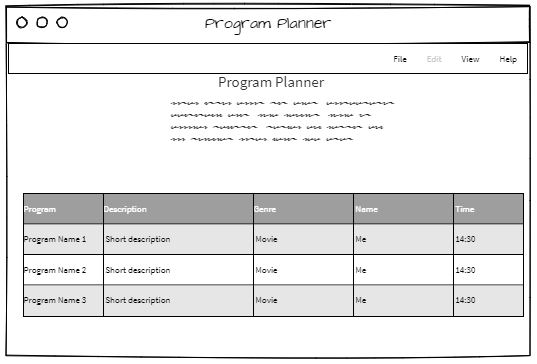
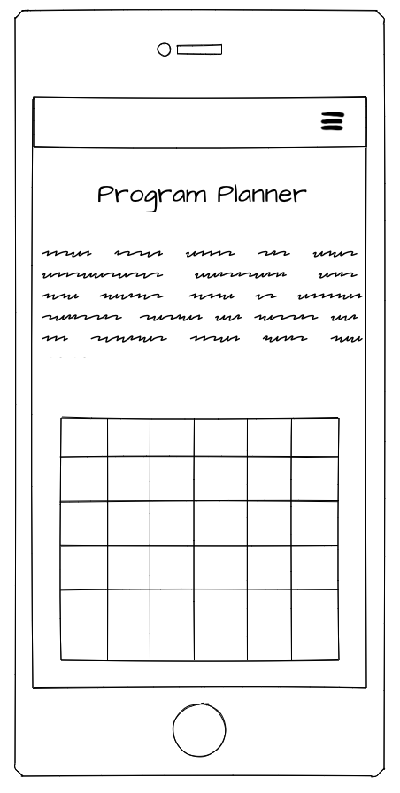

# Program Planner
This program planner is an easy way to store films or TV programs that you are eager to watch. This allows you to enter the name of the film/program, when its on, and also categorise this into different genres such as film, sports, entertainment or arts. If you do not see the category you would like, then you are able to add your own category.

# UX
I wanted to make sure the user could navigate and use the app with ease and simplicity. The layout is clear to understand, with a top heading navigation, with the planner inself displayed on the home page.

Included on the homepage, I also included details on how to use the planner, and key points the user will need to navigate through the app successfully.

## User Stories
> "As a user, I want to be able to be able to store all my favourite programs in one place."

> "As a user, I want to be able to create a list of must watch programs recommended by friends and family."

> "As a user, I would like to be able to use the application on both computer and mobile devices."

## Features
### Responsive
> The application is responsive which is what I wanted to achieve. This means you can view this on a desktop, tablet or phone.

### Navigation
> Creating a simple to use navigation is key. This is sticky across the top of the page with simple and clear page titles. When you reduce the size of the screen, or open this on a tablet or phone, the pages fall into a hamburger icon, which can be clicked to bring the list of pages.

### Add Program
> You are able to easily add a program. This can be done by clicking the 'Add Program' in the navigation, or pressing the green cross at the top right of the programs list.

### Category Management
> On the 'Category Manager' page, from the top navigation, you can view here a full list of what categorys you can use when adding a program. You can edit existing categories or delete ones you feel are not required.
> If you do not see a category which suits, you are easily able to add your own. If you navigate to the 'Category Manager' page on the navigation, scroll to the bottom and you will see an 'Add' button. You can then add a new cateogry to suit your needs.

### Help
> The application is simple to use, however there are key details on how to use different aspects of the app written on the homepage.

## Mockup & Design

I toyed with many different options on how I wanted the application to look, and whether or not I wanted to give the user the option to add a picture when adding a program. I chose eventually against this, as I felt when you were trying to choose a program to add, the name and genre would be sufficient information, and you could waste time searching for a suitable picture.

I decided to layout each program within a table set. This allowed an easy to read set of program, causing minimal issues for the user. Originally, I did not include an edit or delete button on the table; this was added to provide the user more control on what they could see.

I used Adobe XD to put together some initial design ideas, along with the final design:

# Technology & Languages Used
### HTML
> The templates and pages were written in HTML..
### CSS
> I used CSS to style the page how I wanted this to look.
### Flask
> I used Flask Python to install the relevant libraries.
### Python
> I used this to link my Flask application and MongoDB together
### MongoDB
> MongoDB was used to store all data from adding a program, and later displaying this data to the application.
### Bootstrap
> I used the Bootstrap framework to help style my application along with CSS. I used bootstrap forms and some buttons, along with the table used on the homepage.

# Testing
I tested the app thoroughly myself, along with asking friends and family to test to see if any bugs or issues appeared.

I set the Python debugger to true initially, to ensure the application ran as expected, and there was no issues with the code.

A key issue which did arrise during testing was getting the application to talk to the back end MongoDB. I was able to add as many programs as possible, and seeing this appear on the MongoDB, however getting the application to write these back out on the page proved difficult. I did some research on why this was happening, and it appeared to be an outdated version of Mongo running on my machine. I tested running Mongo through MongoLabs, and connected this way, which worked fine.

Updating Mongo on my machine helped erase the previous issue and I could allow this to work fine.

Through testing, feedback from the users enabled me to edit how the application looked. Initially I used bootstrap cards to display each program, but was found when a large number of programs were listed, that there was a lag in the page loading. Also, some of the programs did not list correct, which is why I then turned to tables which enabled quick and easy to read data.

# Deployment
My code was writted initially on Cloud 9, but turned this locally when this service was shut down. I deploted this to Github, and then linked this to Heroku so this can be ran.

Running live on https://programplanner.herokuapp.com/

# Credit
> **Bootstrap** helped provide key functionality, such as the tables and forms used throughout. Also the navigation being responsive was used with Bootstrap.

> I used **Fontawesome** to obtain the icons you see around the application.

> **Google Fonts** provided the great fonts used around the application.
